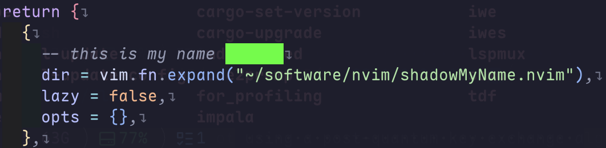

# shadowMyName.nvim

<p align="center">Redact sensitive words — hide your username, tokens, phone numbers and more when you screenshot or record.</p>

`shadowMyName.nvim` renders any text you specify (your system **username** by default) as a solid
color block (foreground == background, so the text becomes unreadable). That way your private
information stays hidden when you **share screenshots, record your screen, or stream**.



## ✨ Features

- 🙈 Redacts your system username (`$USER` / `$USERNAME`) out of the box
- 🎨 Fully customizable shadow block color (foreground, background, bold, etc.)
- 🔤 Supports custom **literal words** (`words`) and **Vim regex patterns** (`patterns`)
- 🧩 Username and custom words can be **toggled independently**
- 🪟 Correct multi-window handling — refreshes on window switch and text change
- 🚫 Filetype exclusion (popups, file trees, etc. are not redacted)
- 🔁 Commands and Lua API: `enable` / `disable` / `toggle` / `refresh` on demand

## ⚙️ Installation

### [lazy.nvim](https://github.com/folke/lazy.nvim)

```lua
{
  "cxwx/shadowMyName.nvim",
  lazy = false,
  opts = {}, -- use defaults, or customize below
}
```

> For local development you can replace the repo URL with
> `dir = vim.fn.expand("~/software/nvim/shadowMyName.nvim")`.

### [packer.nvim](https://github.com/wbthomason/packer.nvim)

```lua
use {
  "cxwx/shadowMyName.nvim",
  config = function()
    require("shadowMyName").setup({})
  end,
}
```

## 🚀 Usage

Call `setup` after install — by default it already redacts your username:

```lua
require("shadowMyName").setup({})
```

Redaction is **live**: typing, switching windows, and opening files all refresh automatically.
Toggle it on the fly with commands:

| Command | Description |
| --- | --- |
| `:ShadowMyNameEnable` | Turn redaction on |
| `:ShadowMyNameDisable` | Turn redaction off (clears all blocks) |
| `:ShadowMyNameToggle` | Toggle redaction |
| `:ShadowMyNameRefresh` | Manually refresh all windows |

Equivalent Lua API:

```lua
require("shadowMyName").enable()   -- on
require("shadowMyName").disable()  -- off
require("shadowMyName").toggle()   -- flip
require("shadowMyName").refresh()  -- refresh
```

## 📖 Configuration

All options with their defaults:

```lua
require("shadowMyName").setup({
  -- Master switch: whether redaction is active
  -- (when off, commands/API can still turn it back on)
  enabled = true,

  -- Username redaction
  username = {
    enabled = true, -- whether to redact the username
    name = nil,     -- custom username; nil => $USER / $USERNAME
  },

  -- Extra literal words to redact
  words = { "secret", "token" },

  -- Extra Vim regex patterns (used as-is; add \c / \C for case sensitivity)
  patterns = { "\\d{3}-\\d{4}", "\\d{16}" },

  -- Match whole words only (wraps with \\< \\>) to avoid over-matching substrings
  whole_word = true,

  -- Whether matching is case sensitive
  case_sensitive = false,

  -- Filetypes where redaction is skipped (popups, file trees, ...)
  filetypes = { "TelescopePrompt", "NvimTree" },

  -- Style of the shadow block.
  -- fg == bg makes the text fully unreadable (default);
  -- set fg != bg to "censor" while still revealing the length.
  highlight = {
    fg = "#00ff00",
    bg = "#00ff00",
    bold = true,
    -- also supported: italic, underline, undercurl, reverse, ...
  },
})
```

### Examples

**Custom shadow color** (black block):

```lua
require("shadowMyName").setup({
  highlight = { fg = "#000000", bg = "#000000" },
})
```

**Redact only custom words, not the username**:

```lua
require("shadowMyName").setup({
  username = { enabled = false },
  words = { "my-real-name", "13800000000" },
})
```

**Redact phone / card numbers with regex**:

```lua
require("shadowMyName").setup({
  patterns = {
    "1[3-9]\\d\\d \\?\\d{4} \\?\\d{4}", -- phone number
    "\\d{4} \\d{4} \\d{4} \\d{4}",       -- 16-digit card number
  },
})
```

**Minimal config** (username only):

```lua
require("shadowMyName").setup({})
```

## 📝 Notes

- Redaction is purely **visual** (it uses `matchadd`); no file content is ever modified.
- By default the foreground equals the background (`fg == bg`), so matched text becomes a solid,
  unreadable color block.
- With `whole_word = true`, the username and words match whole words; regex `patterns` are used as-is.

## License

MIT
